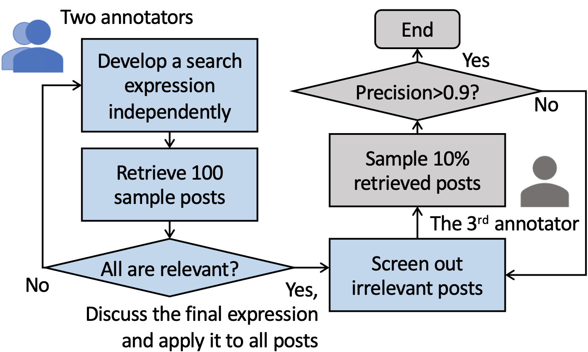

# Health Rumors and Debunking (Fact-checking) Efforts on Weibo During COVID-19

This repository contains annotated data associated with the ICWSM 2022 paper:

W. Yang, S. Wang, Z. Peng, C. Shi, X. Ma, D. Yang.  *Know it to Defeat it: Exploring Health Rumor Characteristics and Debunking Efforts on Chinese Social Media during COVID-19 Crisis.* International AAAI Conference on Web and Social Media (ICWSM). 2022. [[Preprinted pdf](https://arxiv.org/abs/2109.12372)]

This dataset consists of **health rumors** circulated on China's internet during early COVID-19, as well as posts on [Sina Weibo](https://weibo.com) (China's largest microblogging website) intended to refute or **debunk** these rumors. Unlike conspiracy theories, health rumors are about healthcare and medicine and do not involve a primary actor (e.g., the U.S. military). In our paper, we categorize health rumors into two categories: **wish** (which inspires hope) and **dread** (which causes fear). We examine their content and propagation characteristics, as well as the efforts from different groups of users to debunk them. 


### Data Format

`data/health_rumors.csv` contains 408 health rumors that we manually identified as having appeared on China's Internet during the early four months of COVID-19 crisis.

* `rumor_id`: unique identifier for the health rumor;
* `publish_date`: published date of the fact-checking article;
* `rumor_type`: type of the health rumor that includes wish or dread;
* `article_title`: title of the fact-checking article;
* `article_content`: content of the fact-checking article;
* `search_expression`: query string we used to retrieve Weibo posts related to the health rumor from a large dataset;
* `source`: source cited in the fact-checking article;
* `article_url`: url of the article.
* Sample:

```
rumor_id,publish_date,rumor_type,article_title,article_content,search_expression,source,article_url
80016,2020-01-21,wish,放烟花爆竹可以消毒，预防瘟疫,农业上确实有在大棚中燃烧硫磺杀灭害虫细菌的做法...,(烟花|爆竹)+(消毒|瘟疫),医学博士、副主任医师、中华医学会科普分会青年委员,https://vp.fact.qq.com/article?id=a54f4a260301565af3454048724350f5
81628,2020-02-10,wish,谣言：挂烫机可以杀死衣服上的新型冠状病毒,有消息称，使用挂烫机可以杀死衣服上的新型冠状病毒鉴定结果：谣言权威解读：56°C且持续30分钟是用高温杀死新冠状病毒的两个必备条件，也就是说得对衣服的每一个部位都持续烫30分钟以上才有效。,挂烫+(新冠|病毒),头条辟谣,http://toutiao.com/group/6791398324525072910/
82020,2020-02-12,dread,水果、蔬菜表面会附着新型冠状病毒？,,(水果|蔬菜)+(附着|沾染)+病毒,国务院联防联控机制新闻发布会,http://www.piyao.org.cn/2020-02/12/c_1210469941.htm
```

`data/debunking_posts.csv` contains 238,554 debunking posts published on Weibo between January and May 2020. Some of the posts debunked multiple rumors at once.

* Sample:

```
url,rumor_id,rumor_type
https://weibo.cn/comment/IqDc47lFX,80016,wish
https://weibo.cn/comment/IsG23ChSN,81628,wish
https://weibo.cn/comment/ItrKKoMos,82020,dread
```


### Data Collection

The process of data collection includes:

1. We first crawled 11 popular Chinese fact-checking sites for 5,958 articles published from January 2 to April 8, 2020. The crawler was run between January 29 and April 18.

|      | Source                     | Count | Website                                                      |
| ---- | -------------------------- | ----- | ------------------------------------------------------------ |
| 1    | 腾讯较真                   | 563   | https://vp.fact.qq.com                                       |
| 2    | 丁香医生                   | 284   | https://ncov.dxy.cn/ncovh5/view/pneumonia_rumors             |
| 3    | 头条辟谣                   | 1551  | https://toutiao.com/c/user/62596297771/#                     |
| 4    | 微博辟谣                   | 1869  | https://weibo.com/1866405545                                 |
| 5    | 捉谣记                     | 85    | https://weibo.com/6590980486                                 |
| 6    | 阿里健康                   | 56    | https://mdeer.taobao.com/healthhome                          |
| 7    | 台湾Yahoo新闻              | 124   | https://tw.news.yahoo.com/topic/2019-nCoV-rumor              |
| 8    | 中国互联网联合辟谣         | 663   | https://www.piyao.org.cn/2020yqpy                            |
| 9    | 北京辟谣平台               | 423   | https://www.qianlong.com/yiqing2020                          |
| 10   | 湖南省辟谣平台（辟谣侠盟） | 236   | https://moment.rednet.cn/topic/pc/index.html?topicId=62464&siteId=6 |
| 11   | 科普中国                   | 104   | https://piyao.kepuchina.cn                                   |

\* sources 1-7 of the fact-checking articles are commercial companies, while sources 8-11 are government-related organizations.

A total of 408 health rumors were manually filtered from these fact-checking articles.

2. We then filtered posts related to these health rumors from a large Weibo dataset based on the following process. Please see the paper for details.



3. Lastly, we use regular expressions (`utils/regular_expression.txt`) to identify debunking posts that express denials to health rumors and manually filter them for several rounds to ensure precision. A total of 238,554 (201,491 unique) debunking posts were identified.


### Citation

If you are using the dataset or the search schemes, please cite the following in your work:

```
@misc{yang2021know,
      title={Know it to Defeat it: Exploring Health Rumor Characteristics and Debunking Efforts on Chinese Social Media during COVID-19 Crisis}, 
      author={Wenjie Yang and Sitong Wang and Zhenhui Peng and Chuhan Shi and Xiaojuan Ma and Diyi Yang},
      year={2021},
      eprint={2109.12372},
      archivePrefix={arXiv},
      primaryClass={cs.SI}
}
```

